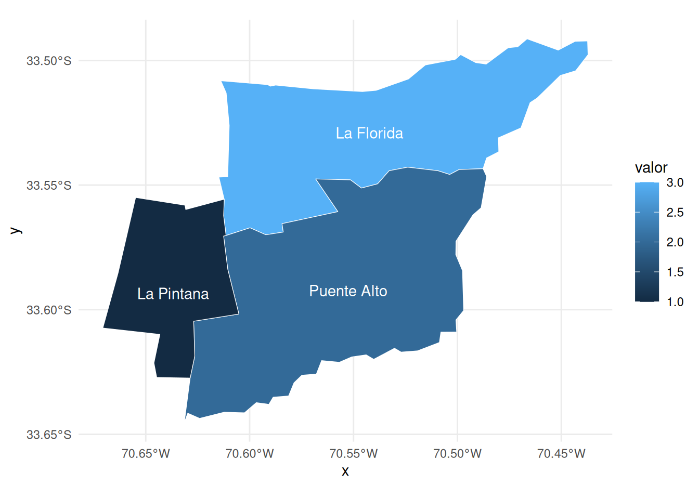

# Mapas comunales

El paquete [territorial](https://bastianolea.github.io/territorial)
puede ser usado para facilitar la visualización de datos espaciales de
nivel comunal. Con un par de funciones de limpieza podemos hacer que
cualquier base de datos con nombres de comunas (incluso mal escritos)
puedan convertirse en mapas.

En este tutorial crearemos datos de ejemplos, usaremos
[territorial](https://bastianolea.github.io/territorial) para
limpiarlos, les agregaremos los polígonos comunales desde
[chilemapas](https://pacha.dev/chilemapas/), y finalmente los
visualizaremos con [ggplot2](https://ggplot2.tidyverse.org).

### Datos de ejemplo

``` r

library(dplyr)
```

Creemos una tabla de datos de ejemplo:

``` r

datos <- tribble(
  ~comuna, ~valor,
  "LA FLORIDA", 3,
  "PUENTE ALTO", 2,
  "LA PINTANA", 1)

datos
#> # A tibble: 3 × 2
#>   comuna      valor
#>   <chr>       <dbl>
#> 1 LA FLORIDA      3
#> 2 PUENTE ALTO     2
#> 3 LA PINTANA      1
```

Confirmamos que estos datos tienen nombres de comuna incorrectos
(escritos con mayúsculas) gracias a
[`territorial::validar_comunas()`](https://bastianolea.github.io/territorial/reference/validar_comunas.md):

``` r

library(territorial)
```

``` r

datos |> 
  validar_comunas(comuna)
#> ℹ Validando calidad de nombres de comuna desde tabla de datos
#> ! Resumen: 3 casos de comunas que no conciden con comunas correctamente escritas (ver `territorial::comunas()`): LA FLORIDA, PUENTE ALTO y LA PINTANA
#> ! Mayúsculas: 3 casos de comunas escritas en mayúsculas: LA FLORIDA, PUENTE ALTO y LA PINTANA
#> ✖ Validación de comunas: se encontraron 6 problemas con las comunas! Usa `territorial::limpiar_comunas()` para solucionarlos.
```

### Obtener mapas comunales

En el ecosistema de R, [el paquete
`{chilemapas}`](https://pacha.dev/chilemapas/), desarrollado por
[Mauricio Vargas](https://pacha.dev) facilita el acceso a polígonos
comunales y regionales de Chile, perfectos para visualizar datos en
mapas. Pero quizás la principal dificultad al crear mapas comunales de
Chile es agregarle los polígonos a los datos de nivel comunal.

Con [chilemapas](https://pacha.dev/chilemapas/) obtenemos los polígonos
de las comunas de Chile con
[`chilemapas::mapa_comunas`](https://pacha.dev/chilemapas/reference/mapa_comunas.html):

``` r

# install.packages("chilemapas")
library(chilemapas)
#> Cargando paquete requerido: sf
#> Linking to GEOS 3.12.1, GDAL 3.8.4, PROJ 9.4.0; sf_use_s2() is TRUE
#> La documentacion del paquete y ejemplos de uso se encuentran en https://pacha.dev/chilemapas/.
#> Visita https://buymeacoffee.com/pacha/ si deseas donar para contribuir al desarrollo de este software.
```

``` r

mapa <- chilemapas::mapa_comunas

mapa
#> # A tibble: 345 × 4
#>    codigo_comuna codigo_provincia codigo_region                         geometry
#>    <chr>         <chr>            <chr>                       <MULTIPOLYGON [°]>
#>  1 01401         014              01            (((-68.86081 -21.28512, -68.921…
#>  2 01403         014              01            (((-68.65113 -19.77188, -68.811…
#>  3 01405         014              01            (((-68.65113 -19.77188, -68.635…
#>  4 01402         014              01            (((-69.31789 -19.13651, -69.271…
#>  5 01404         014              01            (((-69.39615 -19.06125, -69.400…
#>  6 01107         011              01            (((-70.1095 -20.35131, -70.1243…
#>  7 01101         011              01            (((-70.09894 -20.08504, -70.102…
#>  8 02104         021              02            (((-68.98863 -25.38016, -68.987…
#>  9 02101         021              02            (((-70.60654 -23.43054, -70.601…
#> 10 02201         022              02            (((-67.94302 -22.38175, -67.955…
#> # ℹ 335 more rows
```

Para agregar estos polígonos a los datos podemos usar
[`left_join()`](https://dplyr.tidyverse.org/reference/mutate-joins.html)
([revisa este tutorial](https://bastianolea.rbind.io/blog/left_join/)),
pero tenemos el problema de los polígonos vienen solamente con códigos
comunales, y nuestros datos no tienen esa variable, sino apenas los
nombres de las comunas en mayúscula.

### Limpiar datos comunales

Podemos usar [territorial](https://bastianolea.github.io/territorial)
para limpiar los nombres de comunas y luego convertirlos a [códigos
únicos
territoriales](https://bastianolea.github.io/territorial/articles/codigos_unicos_territoriales.html).

Primero limpiamos los nombres de comunas para llevarlos a una escritura
estandarizada y correcta con
[`territorial::limpiar_comunas()`](https://bastianolea.github.io/territorial/reference/limpiar_comunas.md):

``` r

datos_2 <- datos |> 
  mutate(comuna = limpiar_comunas(comuna)) 
#> ℹ Limpiando 3 nombres de comunas (3 son distintas)
#> 
#> ── Paso 1: confirmar comunas correctas
#> ℹ De las 3 comunas distintas, ninguna tiene nombres 100% correctos. Los siguientes pasos intentarán la limpieza
#> 
#> ── Paso 2: coincidencias por limpieza de texto
#> ℹ A partir de la limpieza de texto, se limpiaron 3 de 3 comunas: La Florida, Puente Alto y La Pintana
#> 
#> ── Paso 3: casos especiales
#> ℹ Se encontraron 0 casos especiales:
#> 
#> ── Paso 4: coincidencias aproximadas de texto
#> ! No se limpiaron comunas como parte de este paso
#> 
#> ── Conclusión de limpieza de comunas
#> ✔ De las 3 comunas distintas, se limpiaron 3 en total (100%)
#> 

datos_2
#> # A tibble: 3 × 2
#>   comuna      valor
#>   <chr>       <dbl>
#> 1 La Florida      3
#> 2 Puente Alto     2
#> 3 La Pintana      1
```

Luego podemos agregar los códigos comunales a partir de los nuevos
nombres de las comunas con
[`territorial::as_codigo_comuna()`](https://bastianolea.github.io/territorial/reference/as_codigo_comuna.md):

``` r

datos_3 <- datos_2 |> 
  mutate(codigo_comuna = as_codigo_comuna(comuna))

datos_3
#> # A tibble: 3 × 3
#>   comuna      valor codigo_comuna
#>   <chr>       <dbl>         <dbl>
#> 1 La Florida      3         13110
#> 2 Puente Alto     2         13201
#> 3 La Pintana      1         13112
```

### Agregar polígonos comunales a datos comunales

Ahora que los datos tienen códigos comunales, podemos agregarle los
polígonos con un
[`left_join()`](https://dplyr.tidyverse.org/reference/mutate-joins.html),
pero primero tenemos que convertir los códigos comunales del mapa a
formato numérico:

``` r

mapa <- mapa |> 
  mutate(codigo_comuna = as.numeric(codigo_comuna))
```

``` r

datos_4 <- datos_3 |> 
  left_join(
    mapa,
    join_by(codigo_comuna)
    )
```

### Visualizar mapas de comunas

Ahora los datos cuentan con los polígonos apropiados, y podemos
visualizarlos [siguiendo este
tutorial](https://bastianolea.rbind.io/blog/tutorial_mapa_chile/):

``` r

library(ggplot2)
library(sf)

datos_4 |> 
  st_as_sf() |> 
  ggplot() +
  aes(fill = valor) +
  geom_sf(color = "white") +
  geom_sf_text(
    aes(label = comuna),
    color = "white"
  ) +
  theme_minimal()
#> Warning in st_point_on_surface.sfc(sf::st_zm(x)): st_point_on_surface may not
#> give correct results for longitude/latitude data
```



[Revisa este
tutorial](https://bastianolea.rbind.io/blog/tutorial_mapa_chile/) para
conocer el proceso completo.
